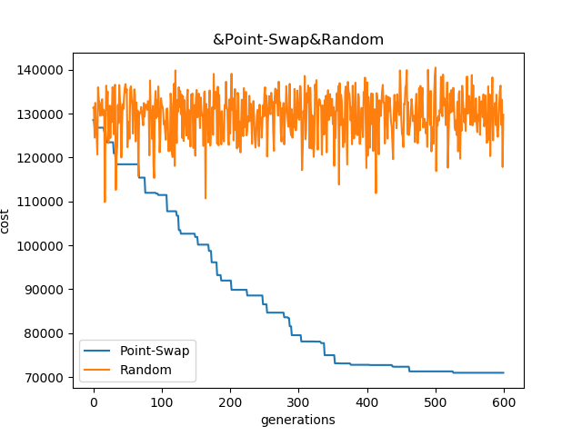
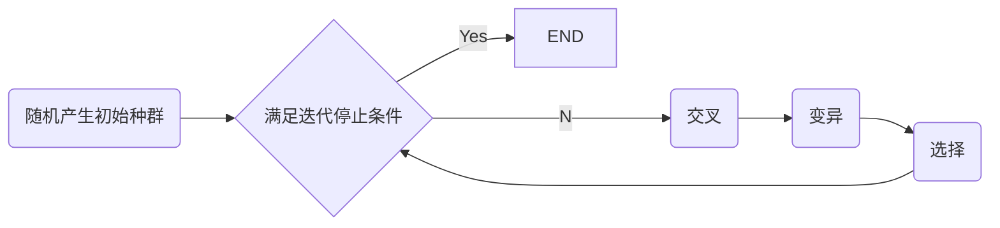
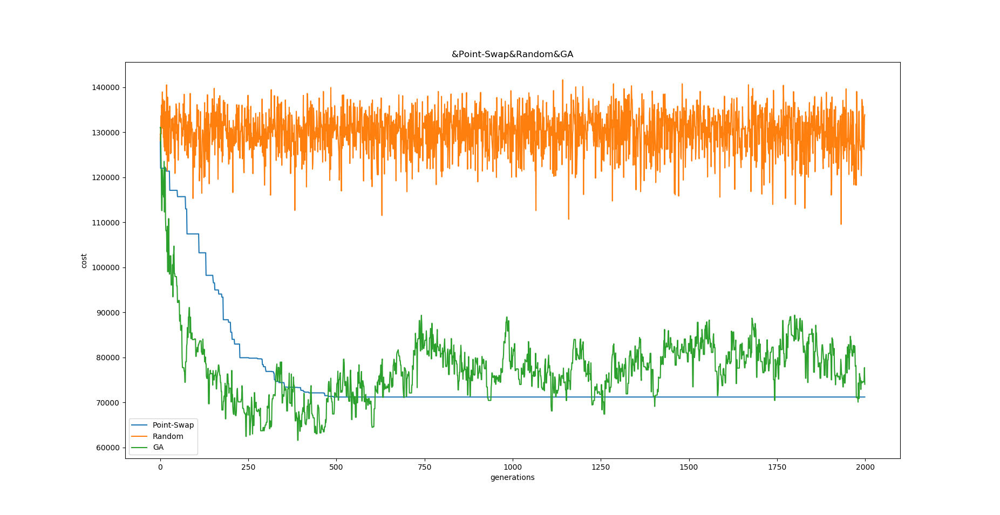
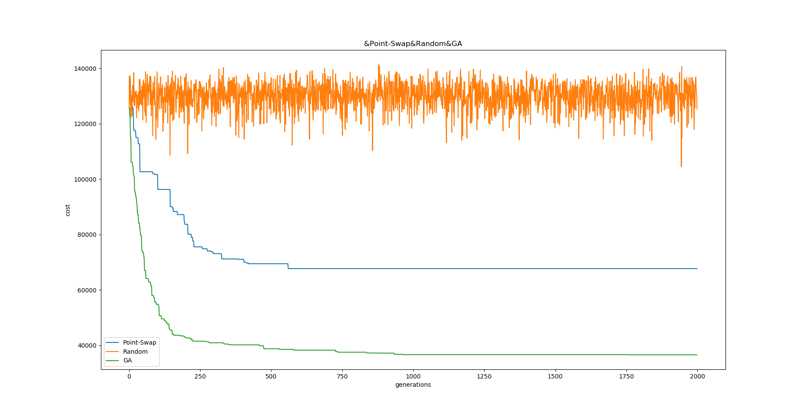
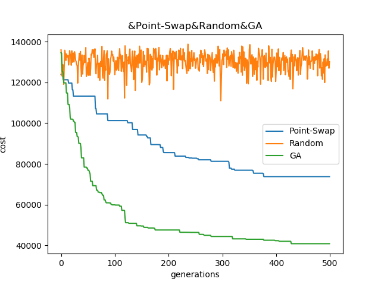
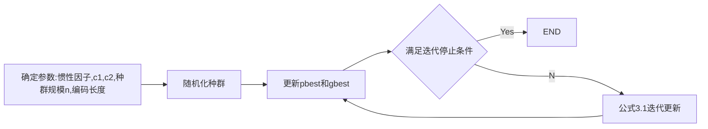

[TOC]


## 0. 粒子群流程

1. 设定参数：种群规模n，城市数量m，迭代停止条件

2. 随机化第一代种群

3. 根据一下公式更新下一代
   $$
   v^{t+1} = v^t + c_1*\alpha_1*(pbest-x^t) + c_2*\alpha_2*(gbest - x^t) \tag{0.1} \\
   $$
   
   $$
   x^{t+1} = x^t + v^{t+1} \tag {0.2}
   $$
   
   
   
4. 更新个体最优和全局最优。满足停止条件退出，否则回到3。

数据库链接：http://elib.zib.de/pub/mp-testdata/tsp/tsplib/tsp/index.html


# 1. TSP问题-点交换粒子群算法

## 1.1 点序列

城市编号1-n，一个粒子就是（2-n）的一个排列(由于回到起点，形成环，所以固定第一个城市是1号)。速度和位置均为一个排列，需要重新定义 位置减法 和 位置加法。采用交换点顺序作为更新的措施。更新公式与 0.3发生改变，具体如下：
$$
x^{t'} = swap(x^t, pbest, possibility) \\
x^{t+1} = swap(x^{t'}, gbest, possibility)
$$
T+1代由T代经过上面两个swap操作而来。第一条是利用经验值，凭个人记忆完成进化到T‘，再利用全局信息进行进化到T+1代。需要确定的参数是概率，具体计算看1.2。


## 1.2 Swap 操作

Swap操作， 参数有三个，分别是原粒子，目标粒子，交换概率。表示原粒子在每一位上都会以交换概率完成原粒子和目标粒子对应位置的交换。

```python
for i in 1..src_particle.length:
    if random() <= swap_possibility:
        replace_index = target_particle.indexOf(src_particle[i])
        swap( src_particle[i], src_particle[replace_index] )
```

比如：原粒子：2314，目标：4321，交换概率：0.25 （后面会讨论该概率定义方法）

原粒子的第一位是2, replace_index = 目标粒子中2的位置 = 3，如果概率命中，交换原粒子的（1,3）。得到1324。逐位依次执行上述操作。


交换概率的选取，先设定每次变化中期望交换的位数，计算相对应概率。上面例子中选取交换概率为0.25，那么每次更新中，都期望发生 n*possibility = 4\*0.25 = 1 次的交换。更进一步，我们可以考虑更新后与更新前的相似度，通过设定相似度来计算对应交换概率。这里我们设定交换概率为1/n，期望每次更新都发生一次交换。


## 1.3 点交换粒子群算法与每代随机进化的结果对比

数据集简介：

NAME : att48
COMMENT : 48 capitals of the US (Padberg/Rinaldi)
TYPE : TSP
DIMENSION : 48
EDGE_WEIGHT_TYPE : ATT

官方提供的**最优解**的路程和是**33523.70850743559**。




# 2. TSP问题-遗传算法与点交换粒子群算法对比

## 2.1 遗传算法

遗传算法采用如下流程，如下图所示。




如第四部分-代码说明中所说，代码高度共享，所以修改PSO的入口函数的部分参数定义为：

ppossibility: 个体变异概率, gpossibility: 单点/双点交叉概率


**交叉**：T代种群n个个体随机组成n/2对夫妻，根据gpossibility（单点/双点交叉概率）确定单点或者双点交叉，随机选取交叉点进行交叉得到两个子代。

**变异**：根据ppossibility（ 个体变异概率）确定是否执行变异，执行变异时，随机选择某一个点与另一个点进行交换（和点交换的进化操作类似）

**选择1**：由全体2n个选择约n个个体生存下来。使用类似转盘赌的方法（简化版本），每个个体淘汰率计算如下：(适应值等于距离和，越大越容易被淘汰)
$$
平均适应值： \alpha = \frac{\sum_{i=1}^{2n} f_i}{2n} \tag{2.1} \\ 
个体淘汰率： \frac{f_i}{2\alpha} \\
生存下来的数量期望值： E = 2n - \sum_{i=1}^{2n} (\frac{f_i}{2\alpha} * 1) = 2n - \frac{2n\alpha}{2\alpha} = n
$$

为保证群体规模，会对选择操作进行规模大小的控制。

**选择2** 选择1下，GA算法收敛速度较慢，改用选择2进行。选择2按照适应值升序排序，选取前n个进入下一代。对比图如下：（上图是使用选择1，下图使用选择2，其余不变）





## 2.2 点序列粒子群算法和遗传算法总结

由2.1的结果显示，粒子群算法较快陷入局部最优解。遗传算法改用”选择2“后收敛速度得到较大提高，并且最终接近最优解。针对粒子群的局限性，第三部分将提出改进后的粒子群算法进行实验。将在第四部分进行更大规模的测试。目前算法结果比对如下。

迭代2000次,数据集简介：

NAME : att48
COMMENT : 48 capitals of the US (Padberg/Rinaldi)
TYPE : TSP
DIMENSION : 48
EDGE_WEIGHT_TYPE : ATT

| ---              | cost               | 收敛子代 |
| ---------------- | ------------------ | -------- |
| Ground Truth     | 33523.70850743559  | --       |
| GA Algorithm     | 36607.5728373541   | \>1750   |
| PSO Algorithm    | 67726.94935552229  | <750     |
| Random Algorithm | 104536.60095971519 |          |

GA算法后部收敛过慢，前半部分收敛效果很好，总体远优于当前实现的PSO算法。

下图是500代的结果：




# 3. TSP问题-改进的粒子群算法

## 3.1 改进的粒子群算法

由于PSO算法较快陷入局部解，参考GA算法的交叉和变异算子增加粒子的多样性。粒子群迭代更新公式修改为：
$$
x^{t+1} = x^{t} + (1-\beta)\cdot\frac{c_1*\alpha_1*pbest}{c_2*\alpha_2*gbest} \tag {3.1}
$$

$$
c_1 是对个体记忆的信赖程度（个体学习因子，0-1的浮点数），代表抽取个体记忆的片段比例 \\
\alpha_1 是随机因子，0-1的浮点数。c_1*\alpha_1得出从个体抽取的记忆片段的百分比。
$$

$$
c_2 是对社会的信赖程度（社会学习因子，0-1的浮点数），代表抽取全局最优解的片段比例 \\
\alpha_2 是随机因子，0-1的浮点数。c_2*\alpha_2得出从全局最优解抽取的记忆片段百分比。\\
$$

$$
\beta 为惯性因子, 惯性因子越大，更大保留原有序列。\\
$$

$$
\frac{c_1*\alpha_1*pbest}{c_2*\alpha_2*gbest} 是粒子的信息增量序列。 \\ 
为计算公式3.1 引入如下定义：\\
$$

>$$
>A是长度为a的1-n的排列的某一子列（0<=a<=n）, \\
>A = <A_1,A_2,...,A_a> | A_i\in set(1,2,...,n) , A_i \neq A_j(i\neq j)\\
>B是长度为b的1-n的排列的某一子列（0<=b<=n）,\\
>B = <B_1,B_2,...,B_b> | B_i\in set(1,2,...,n) , B_i \neq B_j(i\neq j)\\
>$$
>
>$$
>减法定义: C = A-B \tag {3.2} \\
>C = <C_1,C_2,...,C_k>\\
>0\le k\le a \\ C_i \in A, \
>i=1,2,...,k \\
>C_i \notin B , \
>i=1,2,...,k \\
>C 是 A的一个子序列
>$$
>
>$$
>除法定义： \tag{3.3} \\
>Q = \frac{A}{B} = <A - (A-B) ,A-B,B-A> = <B-(B-A),A-B,B-A> \\
>其中，<A,B>表示序列A和B进行拼接。
>$$
>
>$$
>加法定义：X = A+B = <A-B,B>  \tag{3.4}  \\ 
>\\
>$$
>
>$$
>数乘定义： \tag{3.5} \\
>k*A = <A_{i+1},A_{i+2},...,A_{i+[k*a]}> | i \in set(0,1,2,...,a-[k*a]) \& 0\le k \le 1\\
>i从set(0,1,2,...,a-[k*a])中随机抽取一个数
>$$
>
>
>$$
>点乘定义: C = k\cdot A \tag{3.6} \\
>k\cdot A = <A_{1},A_{2},...,A_{[k*a]}>  \\ 0 \le k \le 1
>$$

$$
迭代公式可以根据上述定义进行计算：x^{t+1} = x^{t} + (1-\beta)\cdot\frac{c_1*\alpha_1*pbest}{c_2*\alpha_2*gbest} \\
参数确定： \beta = 0.75 \\
c_1 = 0.4 , \ \ \ \alpha_1 = 随机值0-1 \\
c_2 = 0.6 , \ \ \ \alpha_2 = 随机值0-1 \\
$$


## 3.2 算法流程




## 3.3 实验结果分析


# 4. 数据测试

## 4.1 att48

NAME : att48
COMMENT : 48 capitals of the US (Padberg/Rinaldi)
TYPE : TSP
DIMENSION : 48
EDGE_WEIGHT_TYPE : ATT


# 5. 代码说明

点交换粒子群算法，随机进化和遗传算法 均采用点序列表示一个粒子，所以这三个部分关于粒子的定义均为点序列。所以代码实现中，这三个实验的代码唯一区别是每一代进化的部分有所不同。具体是pso文件的step函数的不一样。如下所示：

```python
	## 点交换的粒子群算法
	def step(self):
		self.generations = self.generations + 1

		for p in self.particles:
			p.evol(p.pbest, self.ppossibility)
			p.evol(self.gbest, self.gpossibility)

		self.gbest = self.findBest(self.particles)
	## 随机进化
	def randomStep(self):
		self.generations = self.generations + 1

		self.particles = []
		for i in range(self.n):
			self.particles.append( Particle(self.length) )

		self.gbest = self.findBest(self.particles)
	## 遗传算法进化
	def GAStep(self):
		## shuffer alg
		## match and crossover
			## mutation
		## update self.gbest
		## choose
		pass ##篇幅较长，此处省略代码细节
```


